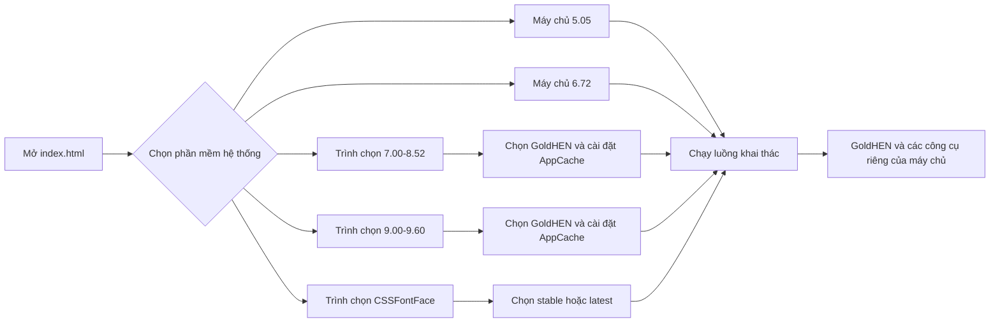

# PlayStation Pulse

  <strong>Trung tâm lưu trữ máy chủ PS4 ưu tiên ngoại tuyến với các luồng khai thác riêng theo phiên bản phần mềm hệ thống và tích hợp GoldHEN.</strong>

  
  
  
  

<!-- Thay phần giữ chỗ bên dưới bằng URL GitHub thô của assets/showcase.webp sau khi tải tệp lên kho lưu trữ. -->

PlayStation Pulse là một bộ sưu tập độc lập gồm các trang máy chủ PS4 tĩnh. Nó cung cấp một điểm truy cập duy nhất để chọn phiên bản phần mềm hệ thống của máy chơi game, sau đó chuyển đến luồng khai thác và GoldHEN tương ứng. Dự án được thiết kế để lưu trữ cục bộ, lưu vào bộ nhớ đệm ngoại tuyến và sử dụng trong trình duyệt PS4.

> Dự án này được xây dựng nhằm phục vụ mục đích giáo dục, bảo tồn và nghiên cứu. Bạn tự chịu mọi rủi ro khi sử dụng. Dự án không liên kết hoặc được Sony Interactive Entertainment chứng nhận.

<strong>Nội dung</strong>

* [Dự án này cung cấp những gì](#what-this-project-provides)
* [Các luồng phần mềm hệ thống được hỗ trợ](#supported-firmware-flows)
* [Cách máy chủ hoạt động](#how-the-host-works)
* [Các phiên bản GoldHEN](#goldhen-versions)
* [Công cụ tải payload](#payload-tools)
* [Lưu vào bộ nhớ đệm ngoại tuyến](#offline-caching)
* [Sử dụng máy chủ](#using-the-host)
* [Thiết kế kỹ thuật](#technical-design)
* [Khắc phục sự cố](#troubleshooting)
* [An toàn và giới hạn](#safety-and-limitations)
* [Ghi công và nguồn đóng góp](#credits-and-attribution)

## Dự án này cung cấp những gì

* Một trình chọn phần mềm hệ thống thống nhất tại [`index.html`](./index.html).
* Các trang máy chủ ngoại tuyến riêng cho phần mềm hệ thống PS4 5.05 và 6.72.
* Các luồng máy chủ PSFree/Lapse cho phần mềm hệ thống 7.00–8.52 và 9.00–9.60.
* Một luồng máy chủ CSSFontFace UAF cho phần mềm hệ thống 6.00–11.02.
* Lựa chọn GoldHEN v2.4b18.10 và v2.4b18.5 tại những nơi máy chủ hỗ trợ cả hai bản dựng.
* Hoạt động ngoại tuyến dựa trên AppCache với các tệp bộ nhớ đệm và tệp kê khai riêng theo từng phần mềm hệ thống.
* Các tiện ích payload riêng theo phần mềm hệ thống trên những nhánh máy chủ cung cấp chúng.
* Một hệ thống giao diện trực quan thống nhất theo phong cách dòng lệnh, cyberpunk và máy tính cổ điển trên các trình chọn, trang bộ nhớ đệm và trang khai thác.
* Bố cục thích ứng cùng các trạng thái lấy nét thân thiện với bàn phím/bộ điều khiển để điều hướng trình duyệt.

## Các luồng phần mềm hệ thống được hỗ trợ

| Phần mềm hệ thống | Điểm truy cập               | Luồng khai thác                      | Lựa chọn GoldHEN                                               | Tiện ích payload                     |
| ----------------- | --------------------------- | ------------------------------------ | -------------------------------------------------------------- | ------------------------------------ |
| **5.05**          | `505/index.html`            | Máy chủ riêng theo phần mềm hệ thống | Trực tiếp trên trang máy chủ                                   | Có                                   |
| **6.72**          | `672/index.html`            | Máy chủ riêng theo phần mềm hệ thống | Trực tiếp trên trang máy chủ                                   | Có                                   |
| **7.00–8.52**     | `700/version-selector.html` | Luồng máy chủ PSFree + Lapse         | Trình chọn phiên bản, sau đó là trang bộ nhớ đệm ngoại tuyến   | Có                                   |
| **9.00–9.60**     | `900/version-selector.html` | Luồng máy chủ PSFree + Lapse         | Trình chọn phiên bản, sau đó là trang bộ nhớ đệm ngoại tuyến   | Có                                   |
| **6.00–11.02**    | `css/version-selector.html` | CSSFontFace UAF + Lapse/NetCtrl      | Trình chọn phiên bản, sau đó là máy chủ `stable` hoặc `latest` | Không có menu tiện ích payload riêng |

Trình chọn gốc lưu phần mềm hệ thống đã chọn vào bộ nhớ cục bộ và chuyển hướng đến nhánh máy chủ tương ứng. Luôn sử dụng máy chủ dành cho đúng phiên bản phần mềm hệ thống được cài đặt trên máy chơi game.

## Cách máy chủ hoạt động

Dự án được thiết kế hoàn toàn tĩnh. Các trang HTML cung cấp giao diện người dùng, các mô-đun JavaScript chạy chuỗi khai thác riêng theo phần mềm hệ thống, các tệp nhị phân cung cấp tài nguyên GoldHEN/bản vá kernel/payload, và các tệp AppCache giúp duy trì luồng đã chọn sau lần cài đặt bộ nhớ đệm ban đầu.

## Các phiên bản GoldHEN

Kho lưu trữ chứa hai lựa chọn GoldHEN ở những nơi được hỗ trợ:

* **GoldHEN v2.4b18.10** — bản dựng mới nhất được các trình chọn cung cấp.
* **GoldHEN v2.4b18.5** — bản dựng ổn định/trước đó dành cho người dùng muốn sử dụng phiên bản cũ hơn.

Các nhánh 7.00–8.52 và 9.00–9.60 chọn bản dựng GoldHEN thông qua trình chọn phiên bản và trang bộ nhớ đệm tương ứng. Nhánh CSSFontFace sử dụng [`css/version-selector.html`](./css/version-selector.html), chuyển hướng đến:

* [`css/latest/index.html`](./css/latest/index.html) cho v2.4b18.10;
* [`css/stable/index.html`](./css/stable/index.html) cho v2.4b18.5.

## Công cụ tải payload

Khả năng cung cấp payload phụ thuộc vào phần mềm hệ thống.

### Các máy chủ có tiện ích payload

Tùy theo nhánh được chọn, các trang máy chủ cung cấp những công cụ như:

* Máy chủ FTP;
* PS4Debug;
* App2USB;
* Sao lưu và Khôi phục;
* Bật cập nhật và Tắt cập nhật;
* Cài đặt AppCache;
* Trình chặn lịch sử;
* Giải mã PUP;
* Đổi tên RIF;
* PSFree Fix trên các nhánh PSFree;
* WebRTE trên các nhánh có tích hợp;
* Kernel Clock trên máy chủ phần mềm hệ thống cung cấp công cụ này.

Danh sách chính xác khác nhau giữa 5.05, 6.72, 7.00–8.52 và 9.00–9.60. Các nút payload tải tệp nhị phân đã chọn thông qua trình tải payload hiện có của máy chủ và có thể yêu cầu một trình nhận payload tương thích trên cùng mạng.

### Phạm vi máy chủ CSSFontFace

Nhánh CSSFontFace cố ý loại bỏ menu tiện ích payload độc lập được sử dụng bởi các nhánh máy chủ khác. Luồng khai thác CSSFontFace vốn tiêu tốn nhiều bộ nhớ, vì vậy việc loại bỏ các công cụ payload bổ sung giúp duy trì lượng bộ nhớ trống cần thiết để khai thác và khởi chạy GoldHEN ổn định hơn. Giao diện của nó tập trung vào:

* Kết quả khai thác;
* Lựa chọn chuỗi Lapse hoặc NetCtrl;
* Bộ đếm ngược Tự động Jailbreak và kích hoạt `Jailbreak` thủ công;
* Tự động tải bản dựng GoldHEN đã chọn.

Phần triển khai CSSFontFace vẫn chứa giai đoạn nhị phân nội bộ cần thiết để hoàn tất luồng khai thác/GoldHEN đã chọn. Giai đoạn nội bộ này không phải là một tiện ích payload có thể lựa chọn bởi người dùng và không tương đương với bộ tiện ích payload tùy chọn đã bị loại khỏi máy chủ này.

## Lưu vào bộ nhớ đệm ngoại tuyến

Tất cả các nhánh máy chủ đều sử dụng tài nguyên tương đối và bộ nhớ đệm ứng dụng của trình duyệt. Các tệp bộ nhớ đệm phải được cung cấp từ những đường dẫn mà các trang truy cập tương ứng yêu cầu; không đổi tên hoặc gom phẳng các thư mục phần mềm hệ thống sau khi triển khai.

| Nhánh           | Luồng bộ nhớ đệm                                                                                                                                            |
| --------------- | ----------------------------------------------------------------------------------------------------------------------------------------------------------- |
| **5.05**        | `505/cache.manifest` được gắn vào trang máy chủ và trang hiển thị tiến trình cài đặt.                                                                       |
| **6.72**        | `672/cache.manifest` được gắn vào trang máy chủ và trang hiển thị tiến trình cài đặt.                                                                       |
| **7.00–8.52**   | Chọn một bản dựng trong `700/version-selector.html`, sau đó sử dụng `cache.html` hoặc `cache5.html` để cài đặt `PSPulse.cache` hoặc `PSPulse5.cache`.       |
| **9.00–9.60**   | Chọn một bản dựng trong `900/version-selector.html`, sau đó sử dụng `cache.html` hoặc `cache5.html` để cài đặt `PSPulse.manifest` hoặc `PSPulse5.manifest`. |
| **CSSFontFace** | Chọn một bản dựng trong `css/version-selector.html`; trang `stable` hoặc `latest` đã chọn sử dụng `cache.manifest` riêng.                                   |

Sau lần cài đặt bộ nhớ đệm thành công đầu tiên, hãy đóng và mở lại trình duyệt PS4 khi trang yêu cầu. Nếu một trang vẫn cung cấp bố cục hoặc tập lệnh cũ, hãy xóa dữ liệu trình duyệt của máy chủ và thực hiện lại quá trình cài đặt bộ nhớ đệm.

Kho lưu trữ cũng bao gồm các tập lệnh tạo nhỏ để xây dựng lại các tệp bộ nhớ đệm sau khi thay đổi tài nguyên. Bất cứ khi nào một tệp được lưu vào bộ nhớ đệm thay đổi, hãy tạo lại tệp kê khai/bộ nhớ đệm tương ứng và kiểm tra để đảm bảo mọi đường dẫn tương đối được tham chiếu đều có sẵn trên máy chủ đã triển khai.

## Sử dụng máy chủ

1. Cung cấp thư mục gốc của kho lưu trữ thông qua máy chủ tĩnh HTTP hoặc HTTPS. Không nên mong đợi trình duyệt PS4 chạy hoàn chỉnh luồng từ URL `file://` không được hỗ trợ.
2. Mở [`index.html`](./index.html) gốc trong trình duyệt PS4.
3. Chọn đúng phạm vi phần mềm hệ thống tương ứng với máy chơi game.
4. Nếu nhánh đã chọn có trình chọn phiên bản GoldHEN, hãy chọn **Latest** hoặc **Stable** và chờ trang bộ nhớ đệm hoàn tất.
5. Trên trang máy chủ, chờ thông báo trạng thái sẵn sàng trước khi bắt đầu khai thác.
6. Sau khi GoldHEN được tải, chỉ sử dụng các công cụ được hiển thị bởi nhánh máy chủ đó.

Đối với máy chủ CSSFontFace, **Tự động Jailbreak** được bật theo mặc định và bắt đầu đếm ngược năm giây. Trong thời gian đếm ngược, bạn có thể chọn `Lapse`, tắt Tự động Jailbreak hoặc để luồng mặc định tiếp tục. Khi Tự động Jailbreak bị tắt, hãy nhấn `Jailbreak` thủ công khi trang đã sẵn sàng.

Trang CSS lưu chuỗi đã chọn trong `localStorage` với khóa `exploitChain` và tùy chọn Tự động Jailbreak với khóa `autoJb`. Trình chọn gốc và các trình chọn GoldHEN cũng lưu các giá trị đã chọn cục bộ để trình duyệt có thể ghi nhớ lựa chọn cuối cùng giữa các lần tải trang.

## Thiết kế kỹ thuật

### Trình chọn gốc

Trang gốc là một danh sách thả xuống tùy chỉnh để chọn phần mềm hệ thống thay vì một tập hợp các liên kết riêng biệt. Nó hỗ trợ tương tác con trỏ và điều hướng bằng bàn phím, cập nhật trạng thái tùy chọn đã chọn, lưu `selectedFirmware` và chuyển hướng đến nhánh máy chủ tương ứng.

### Các nhánh PSFree/Lapse

Các nhánh 7.00–8.52 và 9.00–9.60 bao gồm:

* các mô-đun khai thác PSFree riêng theo phần mềm hệ thống;
* các mô-đun khai thác Lapse và hỗ trợ ROP riêng theo phần mềm hệ thống;
* các bản vá kernel riêng theo phần mềm hệ thống;
* các tệp nhị phân GoldHEN cho hai bản dựng được hỗ trợ;
* các trang bộ nhớ đệm dựa trên AppCache/tệp kê khai;
* trình tải payload và các tệp nhị phân tiện ích riêng của máy chủ.

Các nhánh 7.00–8.52 và 9.00–9.60 duy trì các biến thể tài nguyên `latest` và `stable` riêng biệt để bản dựng GoldHEN đã chọn có thể được lưu vào bộ nhớ đệm độc lập.

### Nhánh CSSFontFace

Phần triển khai CSSFontFace bao gồm đường dẫn userland CSSFontFace UAF, các trình hỗ trợ bộ nhớ/đọc-ghi/ROP dùng chung, các chuỗi khai thác Lapse và NetCtrl, hỗ trợ kernel PS4, các bản vá kernel riêng theo phần mềm hệ thống và trình ghi trạng thái theo phong cách dòng lệnh. Các thư mục `stable` và `latest` được cố ý duy trì song song để có thể được lưu vào bộ nhớ đệm và cung cấp độc lập.

Bảng điều khiển CSS được giữ nhỏ gọn và dễ dự đoán cho trình duyệt PS4: kết quả khai thác, lựa chọn chuỗi, Jailbreak và Tự động Jailbreak. Kiểu lấy nét của chuỗi radio sử dụng bộ chọn `:focus` được hỗ trợ rộng rãi để việc điều hướng bằng bộ điều khiển vẫn được đánh dấu rõ ràng trên công cụ trình duyệt PS4 cũ hơn.

### Bảo trì AppCache

AppCache là công nghệ trình duyệt cũ, nhưng nó là một phần trong mô hình cung cấp máy chủ ngoại tuyến. Hãy coi các tệp bộ nhớ đệm là các sản phẩm được tạo tự động: sau khi thay đổi HTML, JavaScript, tệp nhị phân hoặc tài nguyên bản vá, hãy cập nhật danh sách/băm bộ nhớ đệm tương ứng và kiểm tra riêng đường dẫn tải lần đầu cũng như đường dẫn tải từ bộ nhớ đệm.

## Khắc phục sự cố

### Trang sai hoặc phiên bản cũ đang được tải

Xóa dữ liệu trang web của trình duyệt PS4 đối với máy chủ, đóng và mở lại trình duyệt, sau đó bắt đầu từ trình chọn gốc. Kiểm tra để đảm bảo tệp bộ nhớ đệm của nhánh đã chọn chứa các đường dẫn tài nguyên tương đối hiện tại.

### Bộ nhớ đệm không bao giờ hoàn tất

Đảm bảo kho lưu trữ được cung cấp thông qua HTTP/HTTPS, tệp kê khai có kiểu MIME/cấu hình chính xác trên máy chủ và mọi tệp được liệt kê đều có thể truy cập tại đúng đường dẫn tương đối. AppCache cũ có thể tồn tại sau các lần làm mới thông thường; hãy xóa dữ liệu trang web trước khi thử lại.

### Khai thác không hoàn tất

Xác minh phần mềm hệ thống của máy chơi game và nhánh đã chọn, đóng các tab trình duyệt không liên quan và thử lại từ trạng thái trình duyệt sạch. Trên trang CSSFontFace, hãy thử tắt Tự động Jailbreak và bắt đầu luồng thủ công bằng `Jailbreak`. Độ ổn định của khai thác có thể thay đổi tùy theo bộ nhớ trình duyệt, trạng thái bộ nhớ đệm và điều kiện của máy chơi game.

### Trình duyệt PS4 bị treo

JavaScript không thể khôi phục đáng tin cậy một tiến trình trình duyệt đã ngừng phản hồi. Hãy đóng và mở lại trình duyệt PS4, sau đó tải lại máy chủ tương ứng. Tránh thêm các vòng lặp thử lại hoặc tải lại liên tục; chúng có thể làm tăng tình trạng mất ổn định.

### Payload tiện ích không phản hồi

Chờ cho đến khi máy chủ thông báo rằng luồng khai thác/GoldHEN đã sẵn sàng. Xác nhận máy chủ đã chọn thực sự cung cấp tiện ích được yêu cầu, PS4 và trình nhận payload đang ở mạng dự kiến, đồng thời trình nhận đang lắng nghe trên cổng yêu cầu. Nhánh CSSFontFace không cung cấp các nút payload tiện ích độc lập.

## An toàn và giới hạn

* Chỉ sử dụng máy chủ dành cho đúng phiên bản phần mềm hệ thống của máy chơi game.
* Không ngắt nguồn máy chơi game trong khi khai thác, tải GoldHEN, tải payload hoặc thao tác hệ thống đang chạy.
* Luôn duy trì phương án khôi phục an toàn và các bản sao lưu hiện tại trước khi sử dụng các tiện ích sao lưu, khôi phục hoặc liên quan đến hệ thống.
* Không sử dụng các trang khai thác để truy cập PSN hoặc các dịch vụ trực tuyến khác.
* Không cho rằng một payload là vô hại chỉ vì nó được tích hợp cục bộ; hãy xem xét chức năng của từng tiện ích trước khi tải.
* Luồng CSSFontFace đặc biệt nhạy cảm với lượng bộ nhớ trình duyệt khả dụng; việc loại bỏ các tiện ích payload tùy chọn là một đánh đổi có chủ ý nhằm tăng độ ổn định.
* Không máy chủ nào có thể đảm bảo kết quả giống hệt nhau trên mọi máy chơi game, phiên bản trình duyệt, trạng thái bộ nhớ đệm hoặc cấu hình mạng.

## Ghi công và nguồn đóng góp

**Tác giả:** [BlackArch](https://t.me/sudoBlackArch) 
**Cộng đồng:** [PlayStation Pulse](https://t.me/PlayStation_Pulse) 
**Máy chủ trò chơi cao cấp:** [NodePlay](https://nodeplay.net/)

Kho lưu trữ chứa các thành phần khai thác riêng theo phần mềm hệ thống, các mô-đun hỗ trợ và những thông báo nguồn được bảo lưu từ các dự án gốc. Vui lòng giữ nguyên các thông báo nguồn và thông tin ghi công ban đầu đi kèm những thành phần đó.

> Đối với mọi việc sử dụng các tài liệu hoặc tệp, các liên kết đến tác giả [BlackArch](https://t.me/sudoBlackArch) và nhóm Telegram [PlayStation Pulse](https://t.me/PlayStation_Pulse) phải được giữ lại trên tất cả các trang.

---

  PlayStation Pulse · Bộ sưu tập máy chủ PS4 ngoại tuyến

